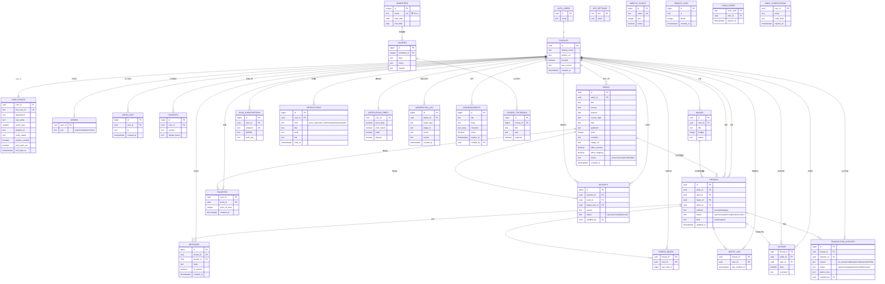

# 資料庫 ERD

圖片版:[ERD.png](ERD.png)、[ERD.pdf](ERD.pdf)(各表只列主要欄位,完整定義見 `supabase/*.sql`)。

```mermaid
erDiagram
  AUTH_USERS ||--|| PROFILES : "id"
  PROFILES ||--|| USER_PRIVATE : "user_id"
  PROFILES ||--o| ADMINS : "管理員"
  PROFILES ||--o{ LOGIN_LOGS : "登入紀錄"
  PROFILES ||--o{ CONSENTS : "同意條款"
  PROFILES ||--o{ BOOKS : "賣家上架"
  PROFILES ||--o{ WISHES : "許願"
  PROFILES ||--o{ THREADS : "買家"
  PROFILES ||--o{ THREADS : "賣家"
  PROFILES ||--o{ MESSAGES : "發訊息"
  PROFILES ||--o{ THREAD_READS : "已讀位置"
  PROFILES ||--o{ NOTIFY_LOG : "推播節流"
  PROFILES ||--o{ PUSH_SUBSCRIPTIONS : "推播訂閱"
  PROFILES ||--o{ FAVORITES : "收藏"
  PROFILES ||--o{ NOTIFICATIONS : "收通知"
  PROFILES ||--o| NOTIFICATION_PREFS : "通知偏好"
  PROFILES ||--o{ RATINGS : "評價者"
  PROFILES ||--o{ RATINGS : "被評賣家"
  PROFILES ||--o{ REPORTS : "檢舉人"
  PROFILES ||--o{ REPORTS : "被檢舉人"
  PROFILES ||--o{ TRANSACTION_DISPUTES : "提出爭議"
  PROFILES ||--o{ MODERATION_LOG : "管理員操作"
  PROFILES ||--o{ ANNOUNCEMENTS : "發布"
  BOOKS ||--o{ THREADS : "針對書聊聊"
  WISHES ||--o{ THREADS : "針對願望聊聊"
  THREADS ||--o{ MESSAGES : "訊息"
  THREADS ||--o{ THREAD_READS : ""
  THREADS ||--o{ NOTIFY_LOG : ""
  THREADS ||--o| RATINGS : "完成後評價"
  THREADS ||--o{ TRANSACTION_DISPUTES : "爭議"
  BOOKS ||--o{ FAVORITES : "被收藏"
  BOOKS ||--o{ REPORTS : "被檢舉"
  SEMESTERS ||--o{ COURSES : "學期課程"
  COURSES ||--o{ COURSE_TEXTBOOKS : "指定教材"

  AUTH_USERS {
    uuid id PK
    text email
  }
  PROFILES {
    uuid id PK
    text display_name
    text picture_url
    boolean banned
    text ban_reason
    timestamptz created_at
  }
  USER_PRIVATE {
    uuid user_id PK
    text line_user_id UK
    text department
    text real_name
    smallint enroll_year
    text student_no
    text verify_status
    boolean student_verified
    boolean own_login_set
    timestamptz last_login_at
  }
  ADMINS {
    uuid user_id PK
    text role "super/moderator/viewer"
  }
  LOGIN_LOGS {
    bigint id PK
    uuid user_id FK
    text ip
    timestamptz created_at
  }
  CONSENTS {
    bigint id PK
    uuid user_id FK
    text version
    text signed_name
  }
  BOOKS {
    uuid id PK
    uuid seller_id FK
    text title
    text course
    text teacher
    text course_dept
    text isbn
    text publisher
    integer price
    text condition
    text image_url
    boolean allow_meetup
    boolean allow_shipping
    text status "active/reserved/sold/hidden"
    timestamptz created_at
  }
  WISHES {
    uuid id PK
    uuid user_id FK
    text title
    integer budget
    text status
  }
  THREADS {
    uuid id PK
    uuid book_id FK
    uuid wish_id FK
    uuid buyer_id FK
    uuid seller_id FK
    text method "meetup/shipping"
    text status "open/accepted/completed/cancelled"
    text kind "trade/support"
    timestamptz updated_at
  }
  MESSAGES {
    bigint id PK
    uuid thread_id FK
    uuid sender_id FK
    text body
    boolean is_system
    timestamptz created_at
  }
  THREAD_READS {
    uuid thread_id PK
    uuid user_id PK
    bigint last_read_id
  }
  NOTIFY_LOG {
    uuid thread_id PK
    uuid user_id PK
    timestamptz last_notified_at
  }
  PUSH_SUBSCRIPTIONS {
    bigint id PK
    uuid user_id FK
    text endpoint UK
    text p256dh
    text auth_key
  }
  FAVORITES {
    uuid user_id PK
    uuid book_id PK
    integer price_at_save
    timestamptz created_at
  }
  NOTIFICATIONS {
    bigint id PK
    uuid user_id FK
    text kind "price_drop/wish_match/trade/dispute/system"
    text title
    text body
    text link
    timestamptz read_at
  }
  NOTIFICATION_PREFS {
    uuid user_id PK
    boolean price_drop
    boolean wish_match
    boolean trade
    boolean dispute
  }
  RATINGS {
    uuid thread_id PK
    uuid seller_id FK
    uuid rater_id FK
    smallint stars
    text comment
  }
  REPORTS {
    bigint id PK
    uuid reporter_id FK
    uuid book_id FK
    uuid target_user_id FK
    text reason
    text status "open/actioned/dismissed"
    uuid handled_by FK
  }
  TRANSACTION_DISPUTES {
    bigint id PK
    uuid thread_id FK
    uuid reporter_id FK
    text reason "no_show/condition/price/harassment/other"
    text status "open/investigating/resolved/dismissed"
    text admin_note
    uuid handled_by FK
  }
  MODERATION_LOG {
    bigint id PK
    uuid admin_id FK
    text target_type
    text target_id
    text action
    text reason
    timestamptz created_at
  }
  ANNOUNCEMENTS {
    bigint id PK
    text title
    text body
    text_array channels
    boolean active
    timestamptz expires_at
    uuid created_by FK
  }
  SEMESTERS {
    integer id PK
    text name UK "例 114-1"
    date start_date
    date end_date
  }
  COURSES {
    bigint id PK
    integer semester_id FK
    text dept
    text name
    text teacher
  }
  COURSE_TEXTBOOKS {
    bigint id PK
    bigint course_id FK
    text title
    text isbn
    boolean required
  }
  APP_SETTINGS {
    text key PK
    text value
  }
  MEETUP_PLACES {
    bigint id PK
    text name UK
    integer sort
    boolean active
  }
  SEARCH_LOGS {
    bigint id PK
    text q
    integer found
    timestamptz created_at
  }
  LOGIN_CODES {
    text code_hash PK
    uuid user_id FK
    timestamptz expires_at
  }
  EMAIL_VERIFICATIONS {
    uuid user_id PK
    text email
    text code_hash
    timestamptz expires_at
  }
```
